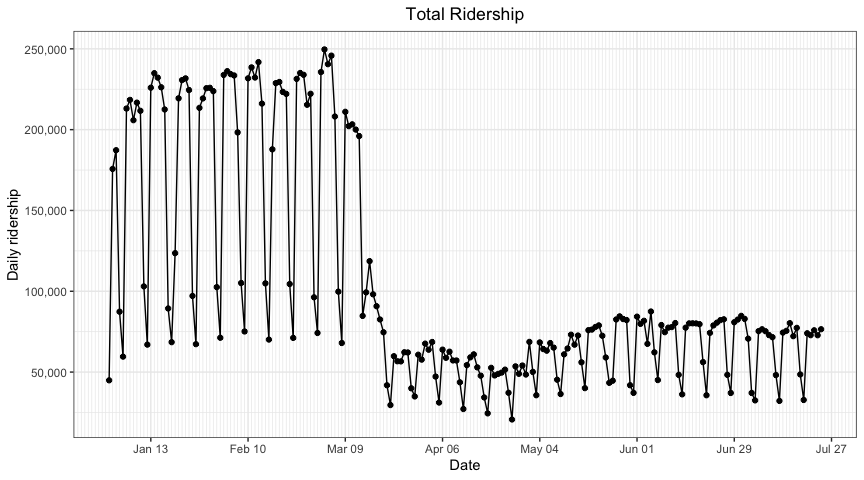

Pittsburgh Bus Data Analysis
================

#### Table of Contents

1.  [Background Info](#info)
2.  [Analysis by Equity Type](#equity)
3.  [Analysis by Service Type](#service)

### 1\. Background Info

  - [Covid fare-free began March 25th and ended
    June 7th.](https://www.portauthority.org/covid-19/coronavirus/)
  - Equity type: People from high equity areas are more likely to be
    dependent on public transit.
  - Service type: Commuter routes tend to draw higher income riders even
    if they run through lower income neighborhoods, whereas coverage
    routes provide lifeline services to low-income
areas.

<!-- -->

### 2\. Analysis by Equity Type

<!-- -->

<!-- --><!-- --><!-- --><!-- -->

### 3\. Analysis by Service Type

<!-- -->

<!-- --><!-- --><!-- --><!-- --><!-- -->
