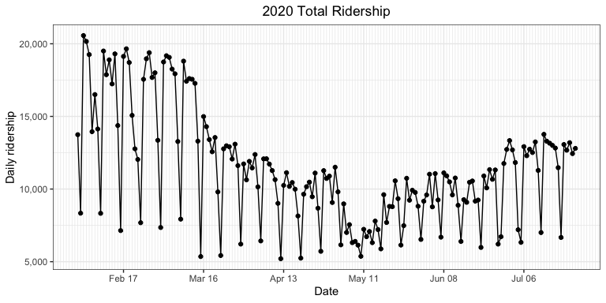
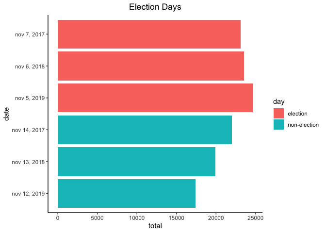
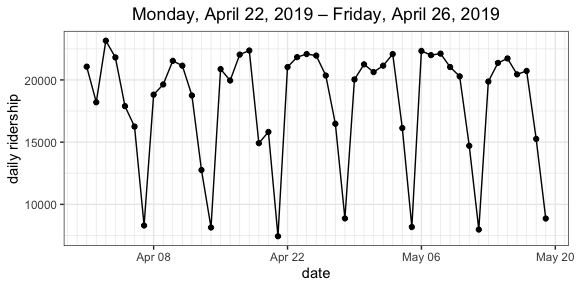
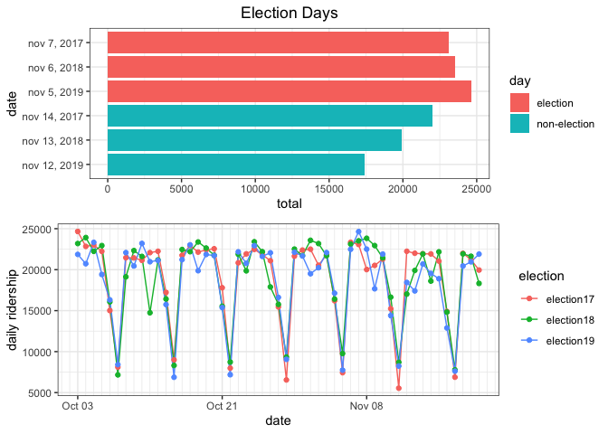
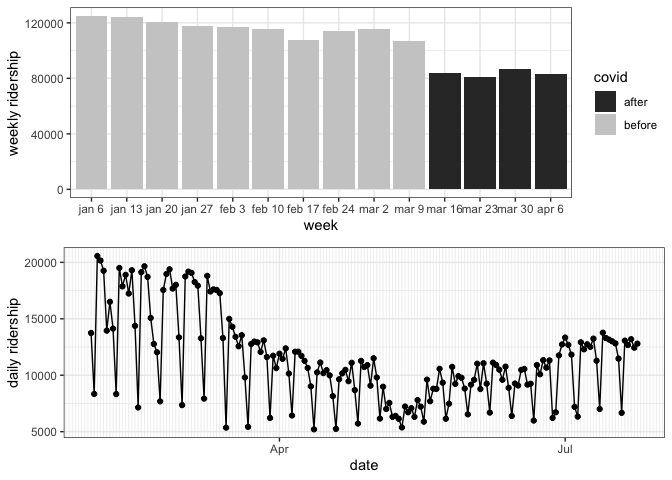

Triangle Bus Data Analysis
================

#### Table of Contents

1.  [Background Info](#info)
2.  [Fare-Free Day Analysis](#fare-free)
3.  [Effect of COVID-19 on Ridership](#covid)

### 1\. Background Info

#### Fare-free dates:

  - International Car-Free Day (2017): Friday, September 22
  - [National Get on Board Day
    (2019)](https://gotriangle.org/getonboard): one free round trip any
    time from Monday, April 22 – Friday, April 26
  - [Election
    Days](https://www.dcovotes.com/public-information/official-elections-results)
      - Nov 7, 2017
      - Nov 6, 2018
      - Nov 5, 2019
  - [Covid fare-free began
    March 23rd](https://gotriangle.org/news/coronavirus-updates-how-gotriangle-responding)

<!-- -->

  - The dip around May 11th needs to be clarified. It could be related
    to the error in the report generating
system.

### 2\. Fare-Free Day Analysis

<!-- -->

<!-- -->

<!-- -->

  - Ridership on Fridays of September does not vary from week to week
    and from Thursday to Friday
  - The number of passengers in the week of April 22 does not seem
    different from the total in other weeks in the same month
  - Election day ridership appears to be going up each
year

### 3\. Effect of COVID-19 on Ridership

<!-- -->
